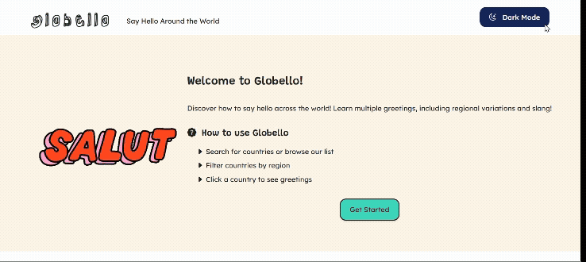

# Globello

#### A language app that allows users to explore different countries around the world and their languages, powered by the REST Countries API

## Description
Globello is an MVP for a conceptual global language learning app. It features the REST Countries API to collect data on countries around the world. This app includes key information about countries: flags, common and official names, region, capitals, languages, and border countries. Users can click on country cards for more information. 

Future iterations will include how to say hello in select languages when visiting a country page. This project was completed as part of an assignment in Per Scholas Full Stack Engineering Bootcamp.

Visit the live site: https://globello.netlify.app

## Table of Contents
* [Tech Stack](#techstack)
* [Features](#features)
* [Design Process](#design)
* [Project Next Steps](#nextsteps)
* [Deployment](#deployment)
* [About the Author](#author)

## Tech Stack
### Languages
* JavaScript
* HTML5
* CSS3
### Libraries
* Tailwind CSS CLI
### APIs
* REST Countries API
* Web Components API (Native API)

## Features
1. Fully responsive grid layout with country cards containing key information
2. Search for countries by name
3. Filter countries by Region
4. View detailed information by clicking on countries
5. View border countries and click on labels to open the detail page
6. Light/Dark Mode toggle with saved preference in local storage

## Trello Planning
To take a look at my planning process for general tasks and bugs, check out my Trello Board below:
* https://trello.com/b/sGEq3iWP/per-scholas-project-1-magali 

## Design Process
The design phase of the project included creating a wireframe in Figma with the layout of the page, collecting assets, selecting colors, and choosing Google Fonts that aligned with the brand and product vision. These assets were plugged into my CSS as Tailwind theme directives for ease of use.

The colors were inspired by the gif I found with the hellos, which i transfered to figma to extract the hex values.

In considering accessibility and readibility of body text, I chose the Lexend typeface for Globello's body text for its accessible properties. This is a highly readable typeface designed to benefit people of all abilities.

### Fonts used
* [Rock 3D](https://fonts.google.com/specimen/Rock+3D) - Globello Logotype
* [Grandstander](https://fonts.google.com/specimen/Grandstander) - Headings
* [Lexend](https://fonts.google.com/specimen/Lexend) - Body

## Project Next Steps
These are a few upcoming features for Globello
* How to say hello section for each country's detail page
* Smooth scrolling for CTA button

## Deployment
This app is hosted on Netlify
[Live Site](https://globello.netlify.app)

### Instructions to clone and run the project:
This project uses Tailwind CSS CLI, and the output.css is not included in the repo. Netlify build command includes the watch command. Please follow the instructions to test the project locally

1. Clone the repository
2. Run `npm install` to retrieve dev dependencies
3. Run `npx @tailwindcss/cli -i ./src/input.css -o ./src/output.css --watch` to generate the output.css file

## About The Author
Hi, I'm Magali. I'm a design-minded engineer with strengths in front-end development and UX design. I enjoy building products with accessibility in mind so that everyone can have access to information. This project allowed me to link my past experience as a language teacher, my design chops, and my skills in JavaScript to create an MVP for an exploratory learning tool that can be used by teachers and students.
    
## Works Cited:
These sources helped me to create a navigation bar that was built with Web Components to persist across all pages of the app without repeating code.
* https://developer.mozilla.org/en-US/docs/Web/API/Web_components
* https://medium.com/@divyajain07/building-web-components-381af38a9cd
* https://www.webcomponents.org/introduction#what-are-web-components 